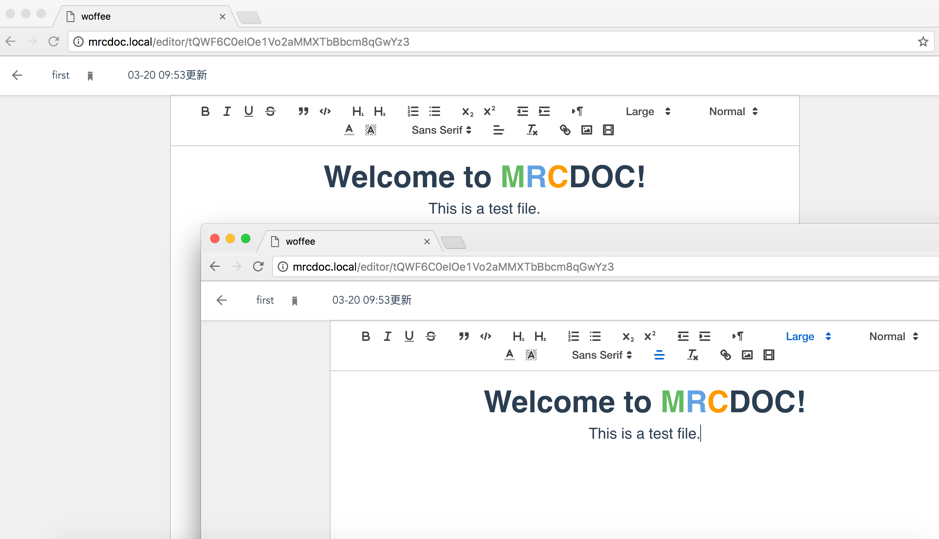

# MRC DOC

## You need

 - Redis
 - MySQL
 - PHP with swoole
 
## Nginx Config

    server {
    
        ...
        
        add_header 'Access-Control-Allow-Origin' "$http_origin";
        add_header 'Access-Control-Allow-Credentials' "true";
        add_header 'Access-Control-Max-Age' 2592000;
        add_header 'Access-Control-Allow-Methods' 'GET,PUT,POST, OPTIONS, DELETE,PATCH';
        add_header 'Access-Control-Allow-Headers' 'X-OAUTH-TOKEN, token, accept, content-type';
        if ($request_method = 'OPTIONS') {
            return 200;
        }
        
        ...
        
    }
    
## Monitoring web socket

    cd .../MRCDOC_API
    php socket.php &
    
    